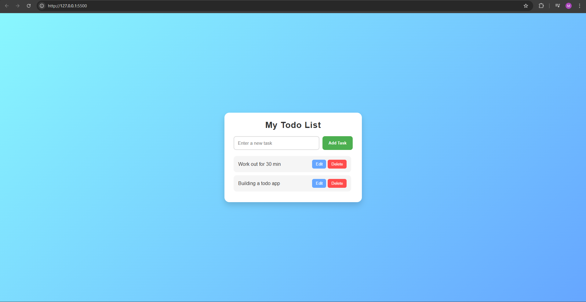

# Simple Todo List App ✅

A simple Todo List application built using **HTML**, **CSS**, and **JavaScript**.

## Features
- Add, edit, and delete tasks
- Simple, clean UI
- Fully functional in any browser

## How to Run
1. Download or clone the repository.
2. Open the `index.html` file in your browser.

## Screenshots
### Main Page

## Author
Developed by Meron Bahru

---
